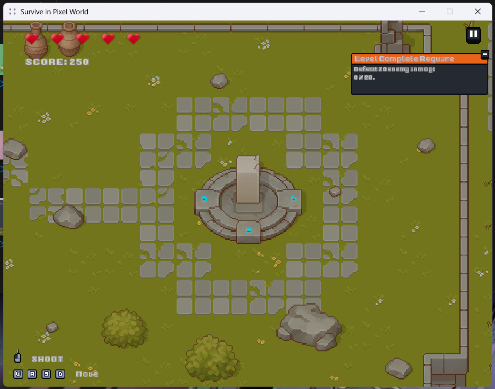
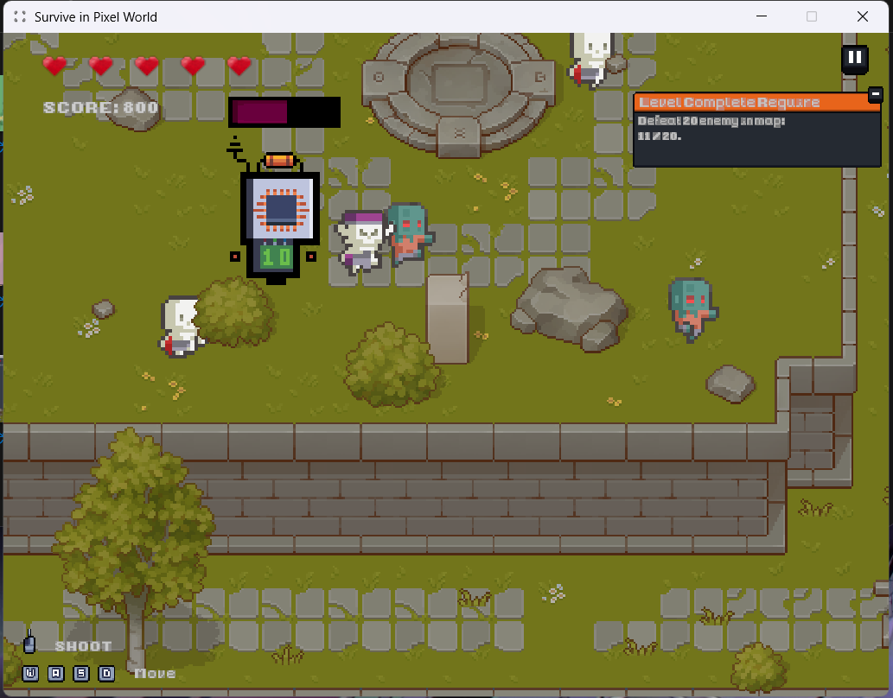
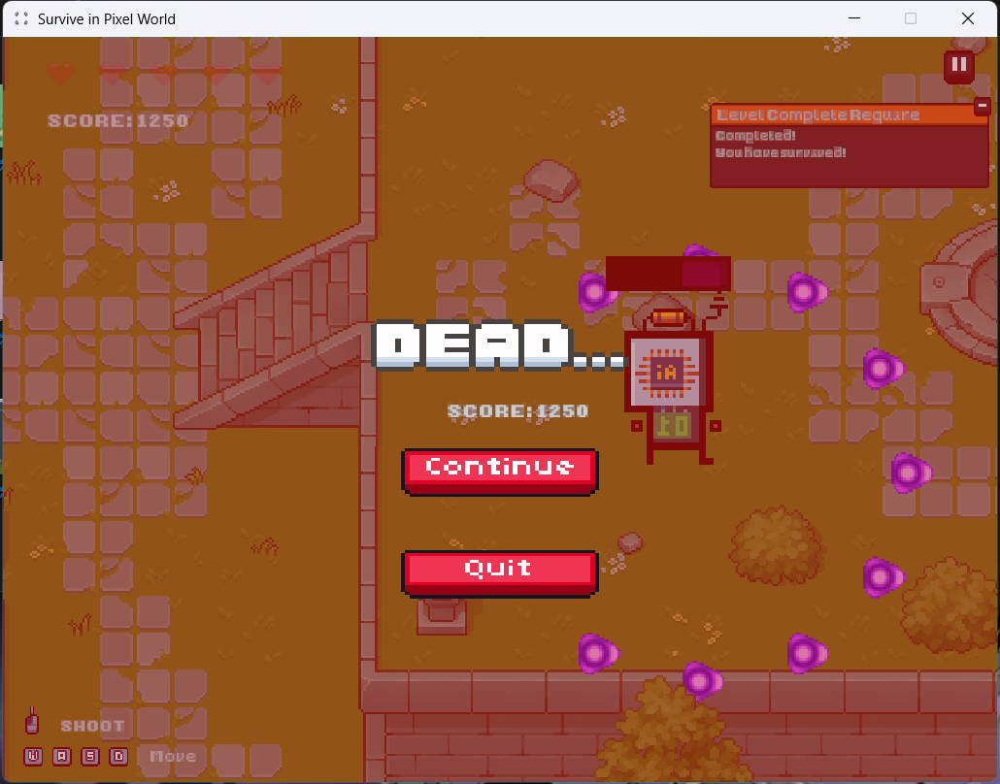

# **Survive in Pixel World**

Một game lấy lối chơi Top-Down bắn zombie với đồ họa pixel đơn giản.

## **Tên Game**

* Survive in Pixel World

## **Thể Loại**

* Survive 
* 2D Top-down Shooter

## **Cách Chơi & Điều Khiển**

Bạn sẽ vào vai một chú mèo lang thang trên một hòn đảo vô định và ...

| Phím | Hành Động |
| :---- | :---- |
| **W, A, S, D** | Di chuyển nhân vật |
| **Chuột Trái** | Bắn đạn |
| **Phím ESC** | Tạm dừng game |

## **Screenshot**

**Menu Chính**

**Gameplay Level 1**

**Teleport to Level 2**

**Gameplay Level 2**

**Start summon enemy in Level 2**

**Boss and Enemy Fight**

**Lose**

**Win**

### **Cài bản test của game**

1. Truy cập vào mục [**Release**](https://github.com/AliceFaul/Survive_in_Pixel_World_Unity/releases/tag/1.0.0) của repo này.
2. Tải về file install mới nhất trong mục Release.
3. Chạy file .exe để cài đặt và vào game.
